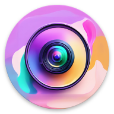
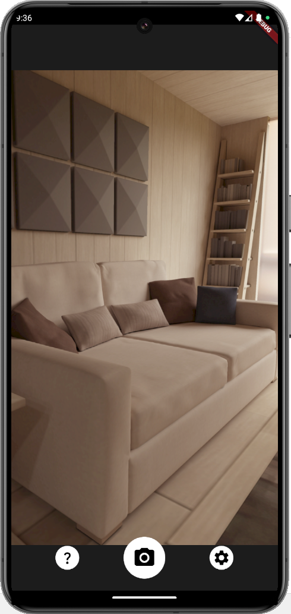

# Reimagine Cam

  

Reimagine Cam is a Flutter-based camera application that leverages generative AI image models to create artistic reinterpretations of photos when captured.

Take a photo using Reimagine Cam, and an AI "reimagined" version of that photo will be displayed and saved to your device's image gallery.

It currently supports DALL·E 2's [variations](https://platform.openai.com/docs/api-reference/images/create-variation) and Clipdrop's [Reimagine](https://clipdrop.co/apis/docs/reimagine) APIs.

## Requirements
- [Flutter](https://flutter.dev/), to build Reimagine Cam from this repository
- Either an OpenAI or Clipdrop API key (or both) with available credit(s)

## Usage
1. Build then launch Reimagine Cam on your device
2. Press the Settings (gear) button to select your desired AI model, entering its respective API key
3. Press the camera button to capture a photo, which will then be reimagined by the AI model specified in Settings and previewed on screen
4. Both the original photo and its AI-reimagined version are saved to the device's image gallery

## Screenshots

  
  

